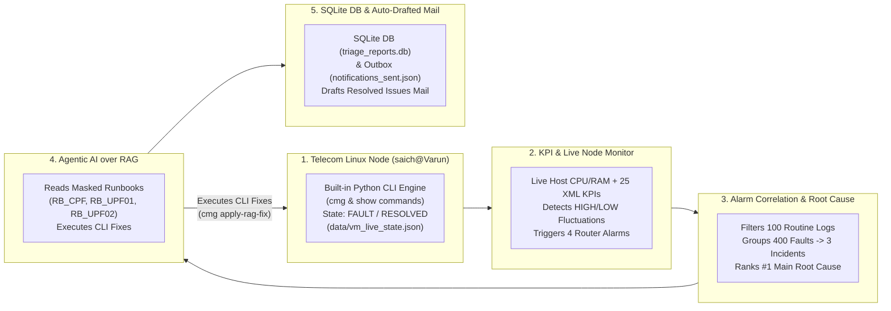

# PS-06: Network Health-Check & Alarm Triage Agent — Complete Installation & Setup Guide

This guide includes **two setup modes**:
- **Mode A (Office Laptop / Locked-Down Corporate PC — Zero VM & Zero Admin Rights Needed)**: Runs 100% natively inside Python using the built-in Telecom Linux VM CLI Engine ([step1_linux_vm.py](file:///c:/Users/saich/OneDrive/Desktop/Hackathon_Infinite/step1_linux_vm.py)) and `data/vm_live_state.json`. Nothing is blocked by corporate IT, Group Policy, or antivirus.
- **Mode B (Full WSL2 Ubuntu-24.04 Linux VM — Personal Laptop)**: Optional setup if you want to install a full WSL2 `Ubuntu-24.04` Linux VM.

---

## 1. System Architecture & 5-Step Workflow Overview



---

## 2. Mode A: Office Laptop Setup (No VM / No Admin Rights Needed)

If your office laptop blocks WSL2, VirtualBox, Docker, or Administrator commands, **you do NOT need to install any Virtual Machine**. [step1_linux_vm.py](file:///c:/Users/saich/OneDrive/Desktop/Hackathon_Infinite/step1_linux_vm.py) and [step2_kpi_and_trigger.py](file:///c:/Users/saich/OneDrive/Desktop/Hackathon_Infinite/step2_kpi_and_trigger.py) run **100% natively in Python**:
- Live CPU core count and RAM usage are read directly from your laptop via Python's standard library (`os` and `ctypes`).
- All Linux & Nokia CMG / SR-OS CLI commands (`cmg status`, `show vm`, `show mda`, `show router Base bfd session`, `show mobile-gateway pdn ref-point-peer`, `uname -a`, `free -m`, `nproc`, `whoami`) execute natively in Python with zero external `.exe` or VM calls.
- Live operational state (`FAULT` vs `RESOLVED`) is persisted in `data/vm_live_state.json`.

### Step A.1: Install Python Packages (User-Scope — No Admin Needed)
Open a regular (non-admin) PowerShell or Command Prompt in the project folder and run:

```powershell
python -m pip install --user streamlit pandas numpy
```

### Step A.2: Verify the 5 Pipeline Steps (100% Native Python)
```powershell
cd C:\Users\saich\OneDrive\Desktop\Hackathon_Infinite

# Step 1: Test Built-in Telecom Linux CLI Engine
python step1_linux_vm.py

# Step 2: Test Live Telemetry & KPI Fluctuation Detection
python step2_kpi_and_trigger.py

# Step 3: Test Alarm Correlation & Root Cause Ranking
python step3_correlate_root_cause.py

# Step 4: Test Agentic AI RAG Retrieval & CLI Remediation
python step4_rag.py

# Step 5: Initialize SQLite DB (data/triage_reports.db) & Drafted Mails
python step5_summary_db_notify.py
```

### Step A.3: Launch the Streamlit Dashboard on Your Office Laptop
```powershell
python -m streamlit run app.py --server.port 8501
```
Open **`http://localhost:8501`** in your browser.

---

## 3. Mode B: Optional WSL2 Linux VM (`Ubuntu-24.04`) Installation (Personal Laptop Only)

If you are on a personal Windows 10/11 machine with Administrator rights and want to install a full WSL2 Linux VM:

```powershell
# 1. Run in PowerShell as Administrator
dism.exe /online /enable-feature /featurename:Microsoft-Windows-Subsystem-Linux /all /norestart
dism.exe /online /enable-feature /featurename:VirtualMachinePlatform /all /norestart
wsl --set-default-version 2

# 2. Install Ubuntu-24.04 Linux VM
wsl --install -d Ubuntu-24.04
```

---

## 4. Project Directory & File Structure

```text
Hackathon_Infinite/
├── app.py                              # Main 5-Tab Streamlit Dashboard UI
├── step1_linux_vm.py                   # Step 1: Zero-VM Built-in Linux & Telecom CLI Runner + Safety Guardrail
├── step2_kpi_and_trigger.py            # Step 2: Live Telemetry + XML KPI Fluctuation Detector
├── step3_correlate_root_cause.py       # Step 3: Alarm Noise Filter, Incident Correlator & Root Cause Ranker
├── step4_rag.py                        # Step 4: Agentic AI over RAG Runbooks & CLI Remediation Engine
├── step5_summary_db_notify.py          # Step 5: SQLite DB Storage & Auto-Drafted Mail Generator
├── mask_and_prepare_data.py            # Data Masking Script (100% Masked Original PS-06 Data)
├── Requirement.txt                     # Project Request Order Specification
├── INSTALLATION_AND_SETUP_GUIDE.md     # Full Setup Documentation
└── data/
    ├── vm_live_state.json              # Live VM State File ("FAULT" or "RESOLVED") — Zero-VM Mode
    ├── alarms/
    │   ├── masked_alarms.json          # 500 Masked Router Events (400 Fault Alarms + 100 Routine Logs)
    │   └── correlated_incidents.json   # 3 Correlated Incidents with #1 Ranked Root Cause
    ├── kpis/
    │   ├── masked_kpis.csv             # 25 Masked XML PM KPI Intervals across CPF & UPF Nodes
    │   └── kpi_anomalies.json          # Live VM + XML KPI Fluctuations & Triggered Alarms
    ├── runbooks/
    │   ├── RB_CPF_Masked.md            # Masked Control Plane Function (CPF) Runbook
    │   ├── RB_UPF01_Masked.md          # Masked User Plane Function 01 (UPF-01) Runbook
    │   └── RB_UPF02_Masked.md          # Masked User Plane Function 02 (UPF-02) Runbook
    ├── topology/
    │   └── masked_topology.json        # Masked Network Topology Graph (CPF-01, UPF-01, UPF-02)
    ├── triage_reports.db               # SQLite Database storing Triage & Agentic AI Resolution Records
    └── notifications_sent.json         # Drafted & Sent Mail Outbox Log
```

---

## 5. Live Demo Walkthrough

1. **Tab 2 (`2️⃣ KPI High/Low → Trigger an Alarm`)**: Click **`💥 Trigger Fault on saich@Varun (Demo Fault Injection)`** to inject the 4 CLI-resolvable telecom faults (`VRTR #2061`, `MOBILE_GATEWAY #2016`, `SNMP #2102`, `MOBILE_GATEWAY #2001`).
2. **Tab 1 (`1️⃣ Linux VM (saich@Varun) → Run Commands`)**: Click **`▶️ Run Commands on saich@Varun`** to inspect the live fault state (`cmg status`, `show vm`, `show router Base bfd session`, `show mobile-gateway pdn ref-point-peer`) and test the safety guardrail by typing `reboot`.
3. **Tab 3 (`3️⃣ Correlate Alarms & Main Root Cause`)**: Inspect the 3 correlated incidents (`INC-2026-001`..`003`) and their `#1 Main Root Cause` ranking.
4. **Tab 4 (`4️⃣ Agentic AI RAG & Resolve Issue`)**: Click **`🤖 Resolve Issues with Agentic AI`** to execute the RAG CLI fixes and auto-draft the **Issues Resolved by Agentic AI** email in **4C**.
5. **Tab 5 (`5️⃣ Mail Alarms / Logs / Summary in DB`)**: Inspect the SQLite database table (**5A**), review the **Drafted Mail of Issues Resolved by Agentic AI** (**5B**), and click **`📩 Send / Save Drafted Mail`** to log it to the outbox (**5C**).
